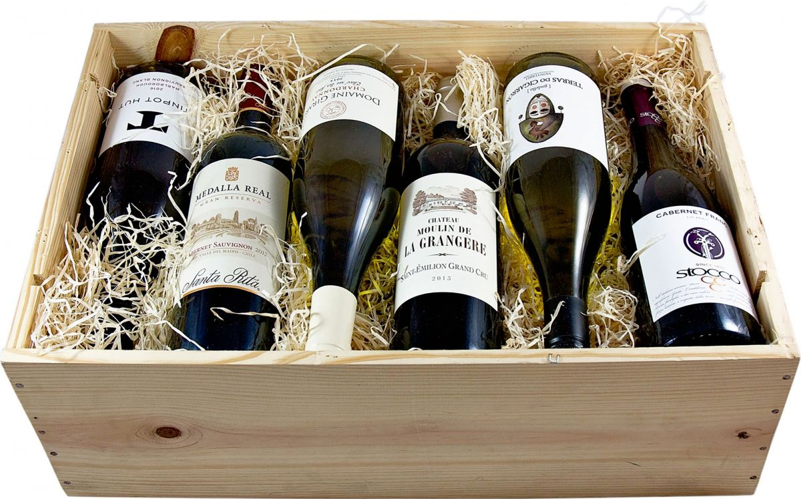
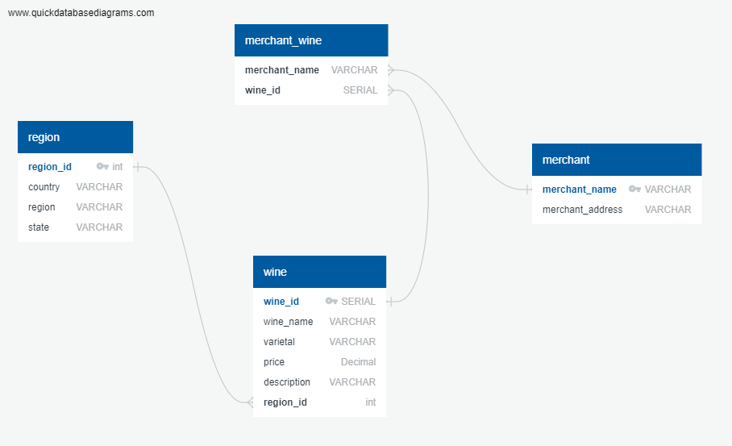

# Wine_ETL

#### Extract:

We extracted the wine info from the following  websites:

https://chatham.bottleking.com

​          info extracted: name, country, region, state, varietal, price, description, merchant, address 

https://www.petrocksliquors.com/category_Wine

​          info extracted: name, country, region, sub_region, grape_varietal, bottle_price, sale_price, description, 		  address 

https://garyswine.com/api/v1/products/search.json

​		 info extracted : name, country, region, state, varietal, price, description, merchant, address, age, sku, 		 type, subtype

https://www.bourbonstreetwineandspirits.com

​		info extracted: name, region (contained state and country), varietal, description, merchant, address

#### Transform:

**Individual CSV cleanup**:

Chatham data: already was part of the scraping code

Gary's wine data: dropped columns to match Chatham data, checked for duplicate

Petrocks data: renamed and dropped columns to match with others, checked for empty rows, checked for duplicates

BourbonStreet data : successfully extracted but not used because the info about the region, country and states  were all under a column called region in a random order

**Final Clean up**:

loaded all CSVs to one notebook, then the following were done to clean them up:

- checked for data type

- converted price column from an object to float type

- filled all NAs with 0 in the price column

- We replaced nulls with "na"

- changed the float type of region id to integer

- added the wine id based on the index of the wine data frame

- added a region id based on the index of the region data frame

  

#### Load:

Created Wine_database and loaded the following CSVs: merchant, region, Wine, Wine_merchant  using the QuickDBD-export (2).sql

---------------------------------------------------------------------------------------------------------------------------------------------------

##### All necessary steps to recreate your database when someone clones our repository:

**Step1-** run the following files (Scrapping and API calls (Chrome is needed))

brian_garyswine_json.ipynb

- ​	produces: garys_wine_real2.csv

petrockswine.ipynb

- ​	produces: petrocks_wine_final.csv

bottleking_scraper.ipynb

- ​	produces: chathambottlekingcleaned.csv

  

**Step2-** run the following notebook:

Clean_up_CSV.ipynb

produces: Allwine.csv

**Step3-** run region_table_test file:

produces: wine.csv, merchant_wine.csv, merchant.csv and rergion.csv

**Step 4**- run the schema and load the tables in the following order:

merchant.csv, region.csv, wine.csv, merchant_wine.csv

Step 5 - running some queries:

queries.sql

more_queries.py

----------------------------------------------------------------------------------------------------------------------------------------------------------

#### ERD Diagram:

#### Sample Queries: 

Give me some examples for the name of Cabernet Sauvignon wines below 10$

------

 What are the most expensive Cabernet Sauvignon wines are in the DB? give me the full information.

------

Can I see the average varietal price per frequency in your DB? what are the top ten?

------

How the average wine price compare in the US, France and Italy? which one has the highest average value?

------

##                         *HOPE YOU ENJOY OUR DATABASE*!

